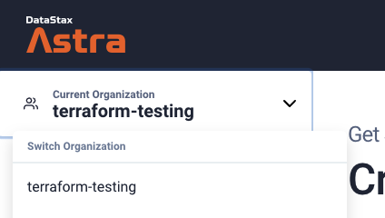
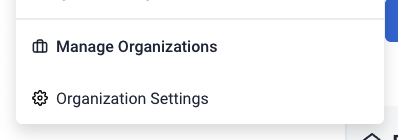
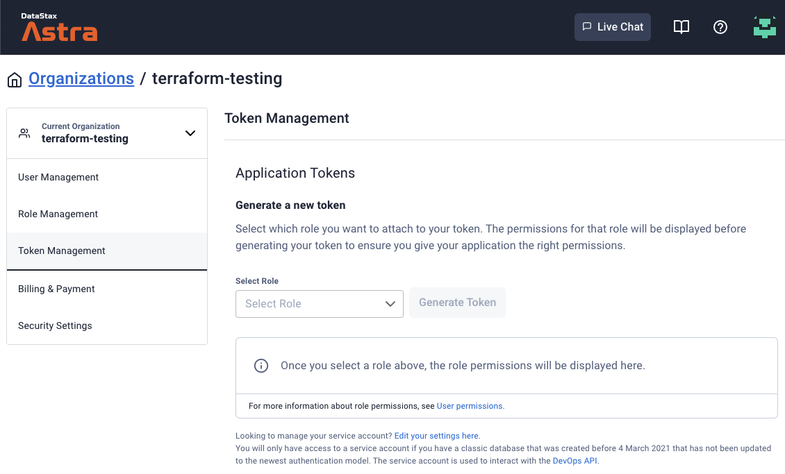
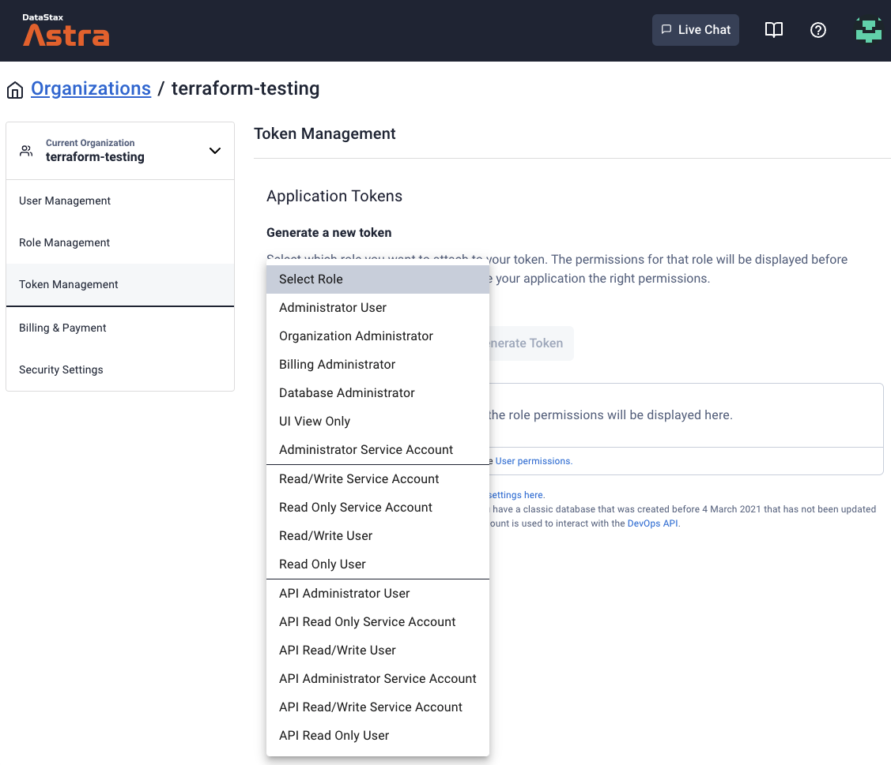
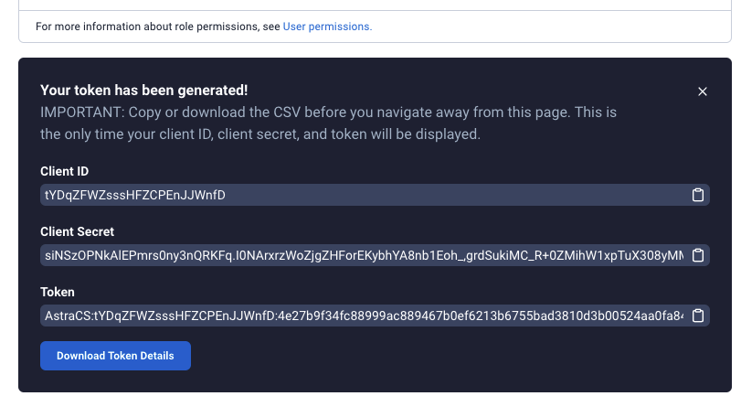
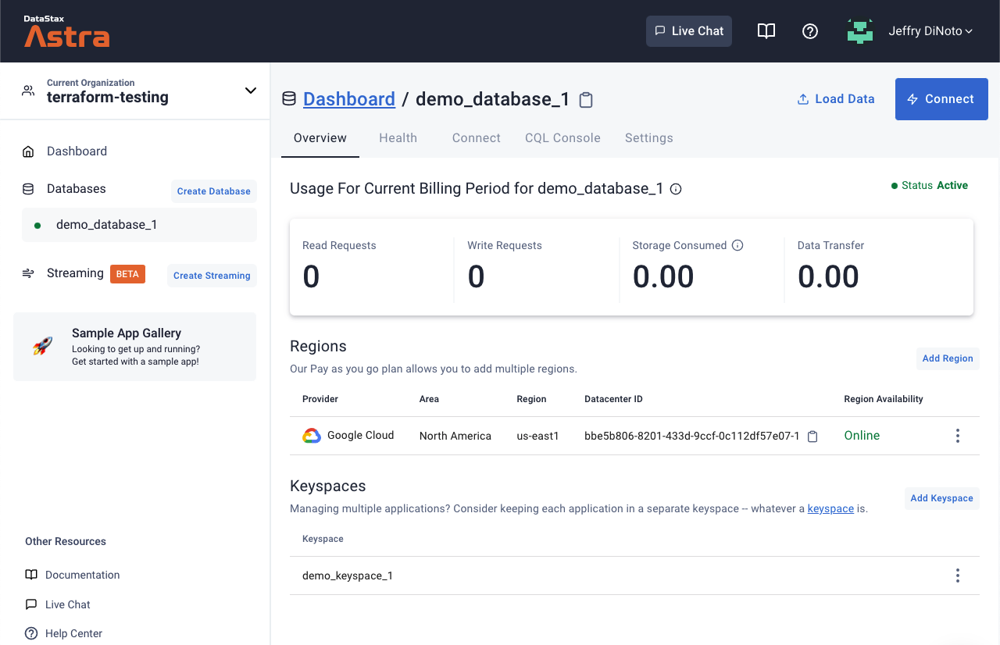
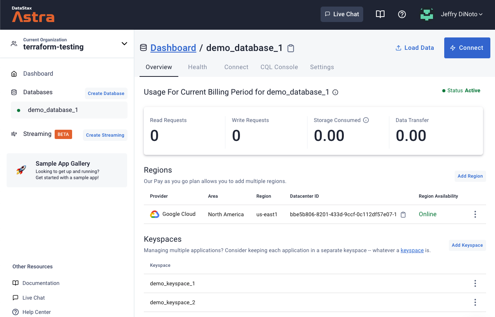

# terraform-provider-astra-demo

## Overview

The DataStax Astra provider for Terraform allows users to manage their [Astra](https://astra.datastax.com/) Serverless databases using Terraform.

To learn more about the project you can find full documentation for the provider on the [Terraform Registry](https://registry.terraform.io/providers/datastax/astra/latest/docs) and the publicly available source code in [GitHub](https://github.com/datastax/terraform-provider-astra).

In this document, we'll walk through a basic demonstration of how how to use the provider to do some basic operations within Astra using Terraform.

## Demo Steps

### Install Terraform

To get started, the first thing you'll need to do locally is install the Terraform CLI if you don't already have it.  The process here will differ based on your platform, we'll be installing on MacOS using [homebrew](https://brew.sh/), but Terraform is also available for Windows and Linux.

You can learn more about installing Terraform from the official Terraform [getting started guide](https://learn.hashicorp.com/tutorials/terraform/install-cli).

On MacOS, the basic steps are:

```
brew tap hashicorp/tap
```

```
brew install hashicorp/tap/terraform
```

You can verify that you have the Terraform CLI installed by running:

```
terraform -version
```

That will indicate what version of the tool is currently installed:

```
Terraform v1.0.11
on darwin_amd64
```

### Initialize project

With terraform available locally, the next step is to initialize your configuration.  We'll start with the basics of our infrastructure definition.

Create a `provider.tf` file:

```
terraform {
    required_providers {
        astra = {
            source = "datastax/astra"
        }
    }
}

variable "token" {}

provider "astra" {
  // This can also be set via ASTRA_API_TOKEN environment variable.
  token = var.token
}
```

This file tells terraform what provider we'll be using, in our case `datastax/astra`.

With this initial version of the file in place, we will initialize the directory with Terraform:

```
terraform init
```

You will see that terraform installs the latest version of the provider.  This command initializes the local state for the terraform managed resources.

```
% terraform init

Initializing the backend...

Initializing provider plugins...
- Finding latest version of datastax/astra...
- Installing datastax/astra v1.0.13...
- Installed datastax/astra v1.0.13 (signed by a HashiCorp partner, key ID 0ABDBFC051FFB5D5)

Partner and community providers are signed by their developers.
If you'd like to know more about provider signing, you can read about it here:
https://www.terraform.io/docs/cli/plugins/signing.html

Terraform has created a lock file .terraform.lock.hcl to record the provider
selections it made above. Include this file in your version control repository
so that Terraform can guarantee to make the same selections by default when
you run "terraform init" in the future.

Terraform has been successfully initialized!

You may now begin working with Terraform. Try running "terraform plan" to see
any changes that are required for your infrastructure. All Terraform commands
should now work.

If you ever set or change modules or backend configuration for Terraform,
rerun this command to reinitialize your working directory. If you forget, other
commands will detect it and remind you to do so if necessary.
```

### Create Astra token

Before we can begin to use Terraform to manage our Astra infrastructure, we need to generate an auth token from within Astra that Terraform can use.

This is done through the [Astra web console](https://astra.datastax.com).

Select the `Organization` that you want to work within:



Next, from that same menu, we will need to edit our `Organization Settings`:



We will then navigate to `Token Management`:



We will be creating a new token.  To do that, you must select a `Role` to be associated with that token.  The specific role required will depend on the privileges required by the operations to be taken from Terraform.



After selecting a role, click `Generate Token` and the request token information will be presented.



This information will not be displayed again, so save the content securely as noted on the screen.

For our purposes, we simply need the token provided, more on how to use it shortly.

### Terraform resources/data sources

In Terraform, there are two primary abstractions that are important to understand:  `Resources` and `Data Sources`.

`Resources` represent the actual cloud elements that are managed through your infrastructure as code.  You can learn more about this through the Terraform [documentation](https://www.terraform.io/docs/configuration/resources.html).

The DataStax Astra provider exposes a number of different types of resources that can be managed.  The full list can be found in the provider [documentation](https://registry.terraform.io/providers/datastax/astra/latest/docs).

`Data Sources` represent a way to query remote state about those resources - in this case, the state within Astra.  You can learn more about this through the Terraform [documentation](https://www.terraform.io/docs/language/data-sources/index.html) as well.

### Plan/Apply database creation

The first resource that we will manage through Terraform will be a `database`.  To do this we'll create a new configuration file called `resources.tf` and add the following content to it:

```
resource "astra_database" "demo_1" {
  name           = "demo_database_1"
  keyspace       = "demo_keyspace_1"
  cloud_provider = "gcp"
  region         = "us-east1"
}
```

We will now use `terraform apply` to make our intended deployment.

We will now be prompted by Terraform to provide the token that we previously generated within Astra:

```
% terraform apply
var.token
  Enter a value:
```

After entering the token, Terraform will then wait for us to inspect and confirm the intended configuration:

```
% terraform apply
var.token
  Enter a value: AstraCS:tYDqZFWZsssHFZCPEnJJWnfD:4e27b9f34fc88999ac889467b0ef6223b6755bad3810d3b00524aa0fa849fbec


Terraform used the selected providers to generate the following execution plan. Resource actions are indicated with the
following symbols:
  + create

Terraform will perform the following actions:

  # astra_database.demo_1 will be created
  + resource "astra_database" "demo_1" {
      + additional_keyspaces = (known after apply)
      + cloud_provider       = "gcp"
      + cqlsh_url            = (known after apply)
      + data_endpoint_url    = (known after apply)
      + grafana_url          = (known after apply)
      + graphql_url          = (known after apply)
      + id                   = (known after apply)
      + keyspace             = "demo_keyspace_1"
      + name                 = "demo_database_1"
      + node_count           = (known after apply)
      + organization_id      = (known after apply)
      + owner_id             = (known after apply)
      + region               = "us-east1"
      + replication_factor   = (known after apply)
      + status               = (known after apply)
      + total_storage        = (known after apply)
    }

Plan: 1 to add, 0 to change, 0 to destroy.

Do you want to perform these actions?
  Terraform will perform the actions described above.
  Only 'yes' will be accepted to approve.

  Enter a value:
```

These changes look correct, so we will type `yes` at the prompt and wait for the deployment to complete:

```
Do you want to perform these actions?
  Terraform will perform the actions described above.
  Only 'yes' will be accepted to approve.

  Enter a value: yes

astra_database.demo_1: Creating...
astra_database.demo_1: Still creating... [10s elapsed]
astra_database.demo_1: Still creating... [20s elapsed]
astra_database.demo_1: Still creating... [30s elapsed]
astra_database.demo_1: Still creating... [40s elapsed]
astra_database.demo_1: Still creating... [50s elapsed]
astra_database.demo_1: Still creating... [1m0s elapsed]
astra_database.demo_1: Still creating... [1m10s elapsed]
astra_database.demo_1: Still creating... [1m20s elapsed]
astra_database.demo_1: Still creating... [1m30s elapsed]
astra_database.demo_1: Still creating... [1m40s elapsed]
astra_database.demo_1: Creation complete after 1m45s [id=bbe5b806-8201-433d-9ccf-0c112df57e07]

Apply complete! Resources: 1 added, 0 changed, 0 destroyed.
```

We can now go into the Astra web console and confirm the creation of the database as expected:



### Plan/apply keyspace creation

With our initial database deployed, let's add an additional resource to our configuration and see how we can build upon the previous example by adding an additional keyspace to our database.

We'll start by editing our `resources.tf` file to add the configuration for an additional keyspace:

```
resource "astra_database" "demo_1" {
  name           = "demo_database_1"
  keyspace       = "demo_keyspace_1"
  cloud_provider = "gcp"
  region         = "us-east1"
}

resource "astra_keyspace" "demo_keyspace_2" {
  name        = "demo_keyspace_2"
  database_id = astra_database.demo_1.id
}
```

We've added a new `astra_keyspace` resource to our configuration.  This also uses the previously generated data from the `demo_1` database to dynamically set the `database_id` that this keyspace should be associated with:

```
database_id = astra_database.demo_1.id
```

This line tells Terraform to take the `id` value (which was retrieved remotely from Astra by the provider) for the `astra_database` resource with name `demo_1`.

We had previously defined our database resource like:

```
resource "astra_database" "demo_1" {
```

Which is where that reference points.


With our configuration altered, we'll use `terraform apply` again to make the changes.  Terraform will again prompt us for the Astra token and to confirm that the expected configuration looks correct:

```
% terraform apply
var.token
  Enter a value: AstraCS:tYDqZFWZsssHFZCPEnJJWnfD:4e27b9f34fc88999ac889467b0ef6223b6755bad3810d3b00524aa0fa849fbec

astra_database.demo_1: Refreshing state... [id=bbe5b806-8201-433d-9ccf-0c112df57e07]

Terraform used the selected providers to generate the following execution plan. Resource actions are indicated with the
following symbols:
  + create

Terraform will perform the following actions:

  # astra_keyspace.demo_keyspace_2 will be created
  + resource "astra_keyspace" "demo_keyspace_2" {
      + database_id = "bbe5b806-8201-433d-9ccf-0c112df57e07"
      + id          = (known after apply)
      + name        = "demo_keyspace_2"
    }

Plan: 1 to add, 0 to change, 0 to destroy.

Do you want to perform these actions?
  Terraform will perform the actions described above.
  Only 'yes' will be accepted to approve.

  Enter a value: 
```

Here you can see that since the database is already deployed, the only change is the creation of a new keyspace.  This looks correct, so we confirm.

```
Do you want to perform these actions?
  Terraform will perform the actions described above.
  Only 'yes' will be accepted to approve.

  Enter a value: yes

astra_keyspace.demo_keyspace_2: Creating...
astra_keyspace.demo_keyspace_2: Creation complete after 0s [id=bbe5b806-8201-433d-9ccf-0c112df57e07/keyspace/demo_keyspace_2]

Apply complete! Resources: 1 added, 0 changed, 0 destroyed.
```

We can again go to the Astra web console to confirm that our expected keyspace has been created:



### Summary

We've demonstrated the basic usage of the DataStax Astra provider for Terraform by deploying a new database within Astra and then altering it add an additional keyspace.

This however is just the beginning of what the provider is capable of and more information about the resources that it can be used to manage through Terraform can be found in the [Terraform Registry documentation](https://registry.terraform.io/providers/datastax/astra/latest/docs)